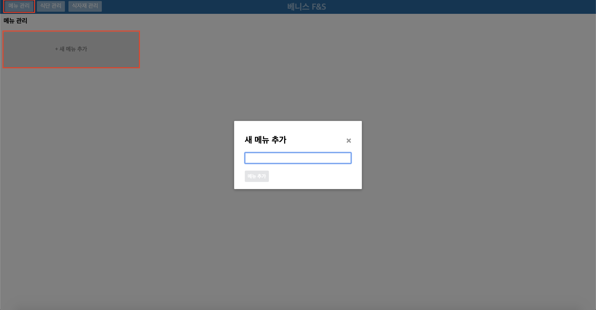
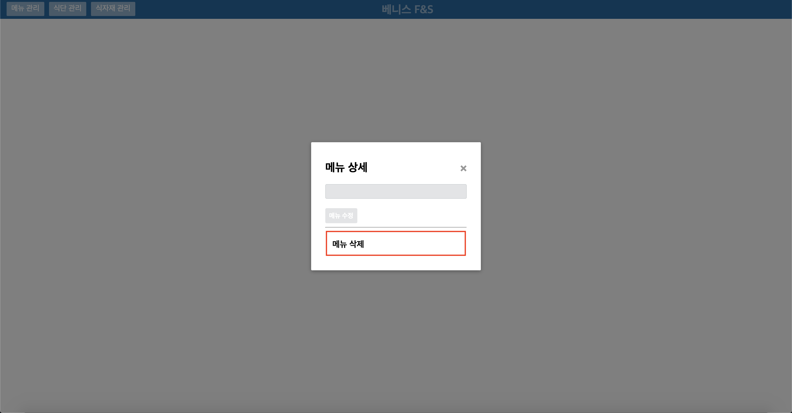
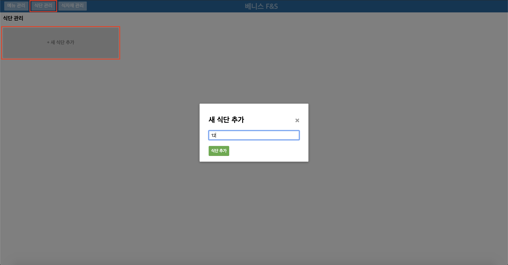
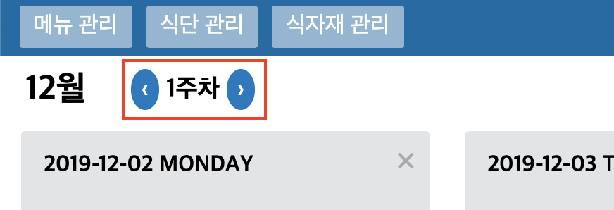
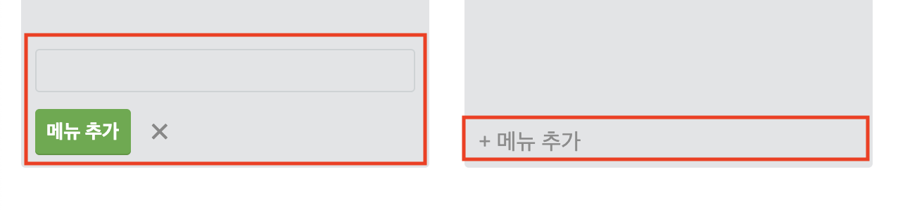
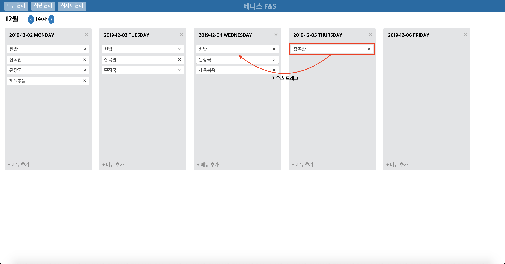
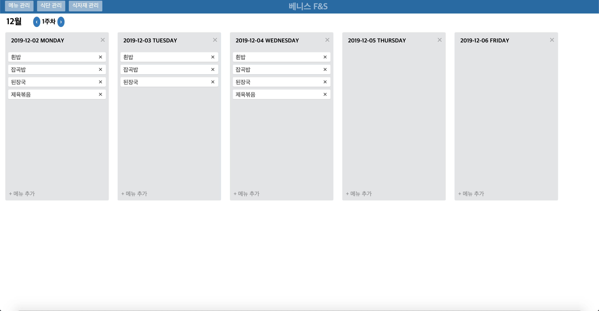

# 구내식당 식단 관리
달랩 10주 프로젝트 (구내식당 식단 관리 서비스)

## 실행
### 1. Build Jar
```shell script
./gradlew bootjar
```

### 2. Web 의존성 설치
```shell script
bash -c "cd cafeteria-manage-web && npm install"
```

### 3. Docker 실행
```shell script
# env 파일은 원하는대로 수정해서 사용하시면 됩니다.
cp .env.default .env 
docker-compose up
```

## 사용자 메뉴얼
### 1. 메뉴 관리
- '메뉴 관리' 탭에서 '+ 새 메뉴 추가' 버튼을 통해 새로운 메뉴 추가 가능

- 생성 된 메뉴 이름 클릭을 통해 해당 메뉴 삭제 가능


### 2. 식단 관리
- '식단 관리' 탭에서 '+ 새 식단 추가' 버튼을 통해 새로운 월별 식단 추가 가능
- 입력창에 숫자만 입력해야 함

- 월별 식단 관리 페이지에서 주차 이동 버튼을 통해 주간 식단 이동 가능

- 월별 식단 관리 페이지에서 일 별로 '+메뉴 추가' 버튼을 통해 메뉴 추가 가능
- '메뉴 관리' 탭에서 생성하지 않은 메뉴는 추가 불가능

- 작성 완료 된 식단 내 메뉴 끼리 드래그를 통해 이동 가능



## 업데이트 계획 (우선순위 정렬)
### 1. 식단 관리 기능 추가 개발
- [X] '메인 메뉴' 페이지 추가(그림 or 사진)
- [X] '메 관리' 탭 내 '+ 새 메뉴 추가' 버튼을 가장 첫번째로 이동
- [X] '메뉴 관리' 탭의 항목 별 카드 크기 축소
- [X] '식단 관리' 탭 내 '+ 새 식단 추가' 버튼을 가장 첫번째로 이동
- [ ] '식단 관리' 탭에서 일간 식단 '메뉴 추가' 버튼에 blur 기능 추가
- [X] '식단 관리' 탭에서 일간 식단 '메뉴 추가' 버튼 클릭 시 입력창에 포커스 지정되도록 수정
- [ ] '식단 관리' 탭 내 일별 식단 관리 표기 시 주요 메뉴 강조 표기 기능 추가
- [ ] '식단 관리' 탭에서 일간 식단 메뉴 추가 시 자동완성 기능 추가
- [ ] '식단 관리' 탭에서 일간 식단 메뉴 추가 시 없는 메뉴일 경우 '새 메뉴 추가'로 이동
- [ ] 일간 식단 관리 기능 중 기본 식단 제공 기능 추가
- [ ] 일간 식단 관리 기능 중 템플릿 기능 추가
- [ ] '식단 관리' 탭 내 일간 식단 관리에 중복된 메뉴 추가 방지 기능 추가
- [ ] 일간 식단 관리 기능 중 해당 날짜의 전체 식단 삭제 기능 추가
- [ ] '식단 관리' 탭 내 공휴일 표기 및 식단 입력 불가 기능 구현
- [ ] '식단 관리' 탭 내 주차 이동 시 해당월의 최대 주차를 넘어가면 다음 월의 1주차로 이동하는 기능 추가
- [ ] '식단 관리' 탭 내 '이번주로 이동하기' 기능 추가
- [ ] 식단 인쇄 기능 추가
- [ ] '식단 관리' 탭 내 일별 식단 내 메뉴 드래그 기능에 복사 선택지 추가
- [ ] '식단 관리' 탭 내 일별 식단 관리에 코멘트 관리 기능 추가
- [ ] '식단 관리' 탭 내 일별 식단 관리에 해당 일자 날씨 표기 기능 추가
- [ ] '식단 관리' 탭 내 일별 식단 관리에 고정 메뉴 지정 기능 추가
- [ ] '식단 관리' 탭 내 주석 CRUD 기능 추가
- [ ] 여러 년도의 식단을 관리할 수 있도록 '식단 관리' 기능 개편

### 2. 식자재 관리 기능 신규 개발
- 메뉴 관리 기능과 유사한 식자재 추가, 삭제 기능 추가
- 식자재 이름, 유통 기한 입력 및 관리 기능 추가

### 3. 메뉴 관리 기능 추가 개발
- 메뉴별 카테고리 분류 기능 추가
- 메뉴별 필요 식자재 등록, 관리 기능 추가

### 4. 사입서 관리 기능 신규 개발
- 기존 기능들을 바탕으로 주간, 월별 필요한 식자재의 총량 계산 기능 추가
- 각 식자재 별 유통 기한에 맞는 장보기 일자 추천 기능 추가